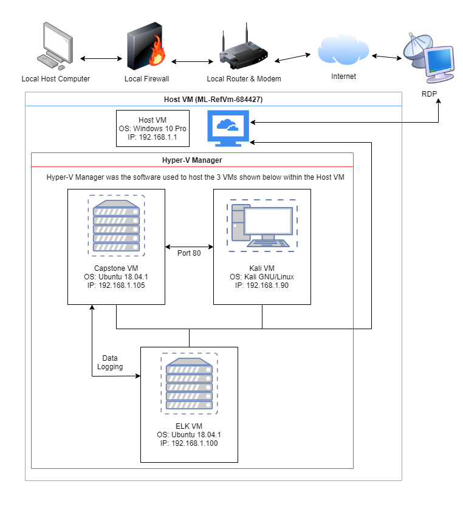

# Red-Vs-Blue-Project-1: Assessment, Analysis, and Hardening of a Vulnerable System
This project utilized Remote Desktop Protocol to access a pre-built VM which contained more VMs within its Hyper-V Manager.

This document will cover a quick overview of the project. Specific details can be found in the [Project Presentation](/Project-Presentation/Capstone_Engagement_Presentation.pdf).

## Table of Contents

Section 1: Red Team

Section 2: Blue Team

Section 3: Conclusion

## Red Team

The goal of the red team was to "capture a flag" located in the directories of the Linux server host VM, which is the "Capstone VM" in the network diagram, using only the "Kali VM".
To do this, a metasploit connection needed to be made with the server so that the Kali VM could have unfettered access to the contents of the Capstone VM through it's command line.

This was done in 7 steps.

Step 1: Discover the IP address of the Linux server using nmap.

Step 2: Locate the hidden directory on the server though navigating the different directories available on the Linuc server.

Step 3: Brute force the password for the hidden directory using Hydra.

Step 4: Crack the password hash found in the hidden directory by using free online resources such as crackstation.net.

Step 5: Use the password and instuctions found in the hidden directory to connect to the server via WebDAV .

Step 6: Create a PHP reverse shell payload, set up an msf listener, upload the payload to the WebDAV directory, navigate to it on the server, and click it to establish a meterpreter connection with the Capstone VM.

Step 7: Find the flag using the "find" command.
